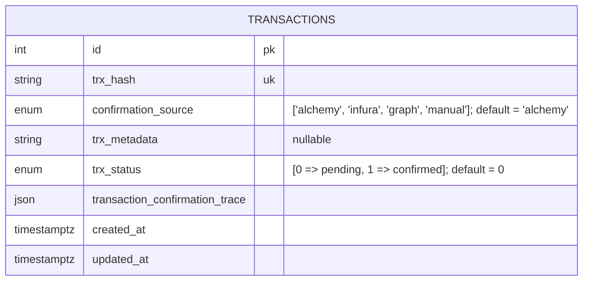
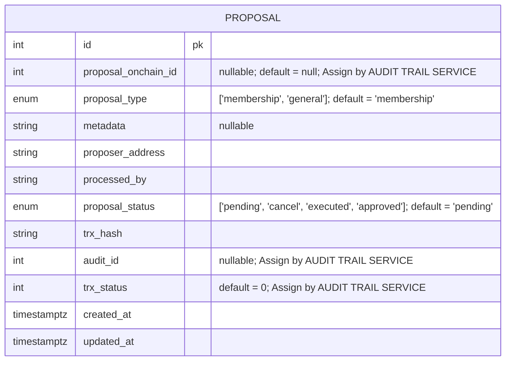

# FinCube: DAO Proposal Governance

## ER Diagram

_Note: timestamptz is used so that we can keep everything in UTC_

### Audit Trail Service

### DAO Service

### User Management Service

_Note: By default, there will be some roles built into the system._
_These are:_
_1. Super Admin: All Powerful. Approves new Organization applications and the Organization Admin_
_2. Organization Admin: Applies for an Organization. First member of its Organization. Manages rest of the members of its own Organization_
_3. Organization User: A generic member of the Organization. Works as an interface for more concrete dynamic roles depending on the Organization_
_4. End User (optional): Some projects may require end users who are not part of any organization and act as consumers in the system_

_There will also be a PERMISSIONS table and a ROLE_PERMISSIONS junction table which will vary based on different project needs_

