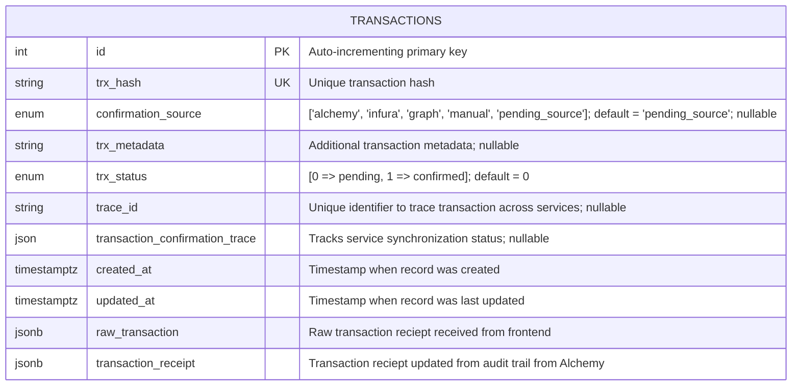
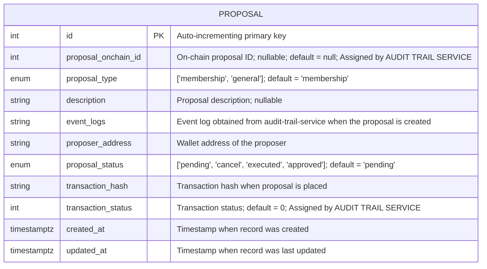
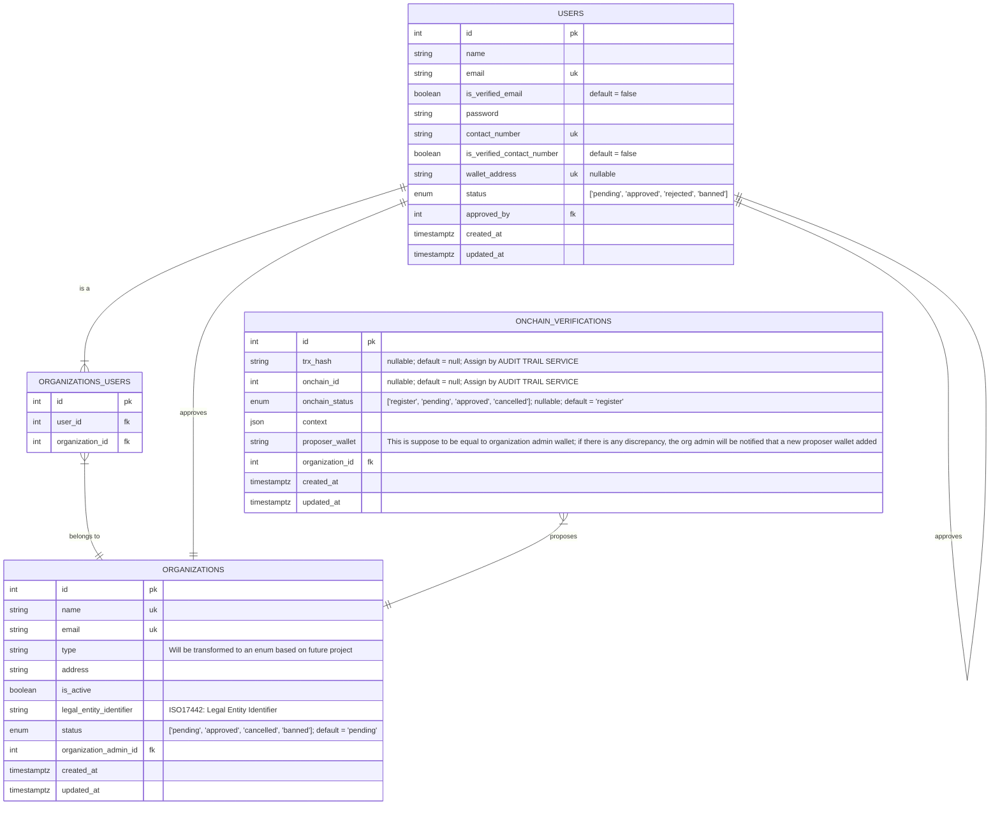

# FinCube: DAO Proposal Governance

## ER Diagram

_Note: timestamptz is used so that we can keep everything in UTC_

### Audit Trail Service



The structure of raw_transaction and transaction_receipt:

```bash
Raw transaction
{
    "nonce": 42,
    "gasPrice": "20000000000",
    "gasLimit": "21000",
    "to": "0xF15E6b68541AAe83bB96F61498812c3E0A35F09b",
    "value": "1000000000000000000",
    "data": "0xa9059cbb000000000000000000000000F15E6b68541AAe83bB96F61498812c3E0A35F09b0000000000000000000000000000000000000000000000000de0b6b3a7640000",
    "v": 27,
    "r": "0x1234567890abcdef1234567890abcdef1234567890abcdef1234567890abcdef",
    "s": "0xfedcba0987654321fedcba0987654321fedcba0987654321fedcba0987654321"
}

Transaction Reciept
 {
    "transactionHash": "0x1234567890abcdef1234567890abcdef1234567890abcdef1234567890abcdef",
    "transactionIndex": 5,
    "blockHash": "0xabcdef1234567890abcdef1234567890abcdef1234567890abcdef1234567890",
    "blockNumber": 18500000,
    "from": "0x742d35Cc6634C0532925a3b8D4C9db96C4b4d8b6",
    "to": "0xF15E6b68541AAe83bB96F61498812c3E0A35F09b",
    "cumulativeGasUsed": 121000,
    "gasUsed": 21000,
    "contractAddress": null,
    "logs": [],
    "status": 1
}
```

Taken from: [Alchemy Docs](https://www.alchemy.com/docs/data/utility-apis/transactions-receipts-endpoints/alchemy-get-transaction-receipts)

### DAO Service



### User Management Service

_Note: By default, there will be some roles built into the system._
_These are:_
_1. Super Admin: All Powerful. Approves new Organization applications and the Organization Admin_
_2. Organization Admin: Applies for an Organization. First member of its Organization. Manages rest of the members of its own Organization_
_3. Organization User: A generic member of the Organization. Works as an interface for more concrete dynamic roles depending on the Organization_
_4. End User (optional): Some projects may require end users who are not part of any organization and act as consumers in the system_

_There will also be a PERMISSIONS table and a ROLE_PERMISSIONS junction table which will vary based on different project needs_

