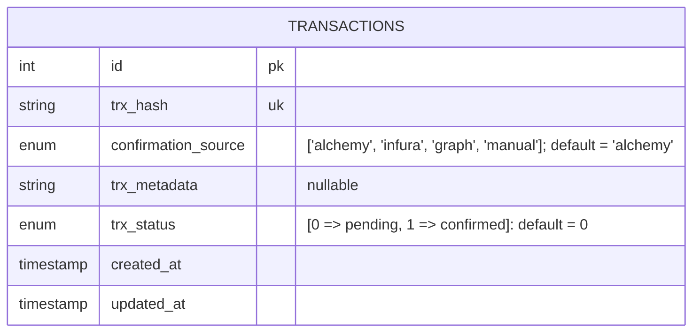
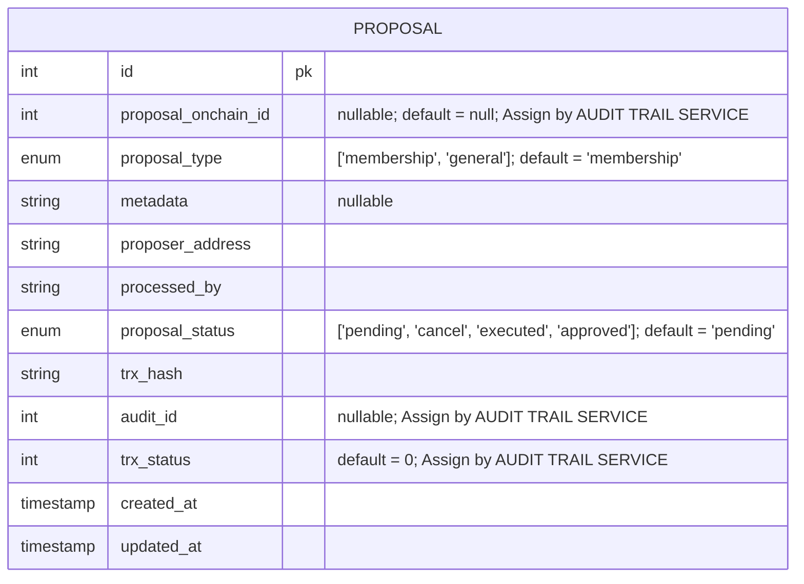
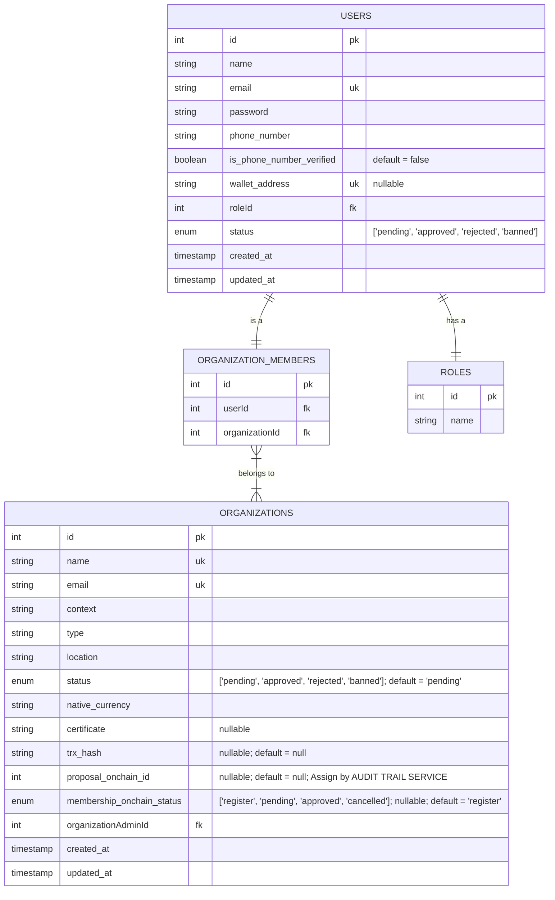

# FinCube: DAO Proposal Governance
## ER Diagram

### Audit Trail Service

```mermaid
erDiagram

    TRANSACTIONS {
        int id pk
        string trx_hash uk
        enum confirmation_source "['alchemy', 'infura', 'graph', 'manual']; default = 'alchemy'"
        string trx_metadata "nullable"
        enum trx_status "[0 => pending, 1 => confirmed]: default = 0"
        timestamp created_at
        timestamp updated_at
    }

```

### DAO Service

```mermaid
erDiagram

PROPOSAL {
        int id pk
        int proposal_onchain_id "nullable; default = null; Assign by AUDIT TRAIL SERVICE"
        enum proposal_type "['membership', 'general']; default = 'membership'"
        string metadata "nullable"
        string proposer_address
        string processed_by
        enum proposal_status "['pending', 'cancel', 'executed', 'approved']; default = 'pending'"
        string trx_hash
        int audit_id "nullable; Assign by AUDIT TRAIL SERVICE"
        int trx_status "default = 0; Assign by AUDIT TRAIL SERVICE"
        timestamp created_at
        timestamp updated_at
    }
```

### User Management Service

```mermaid
erDiagram

USERS {
    int id pk
    string name
    string email uk
    string password
    string phone_number
    boolean is_phone_number_verified "default = false"
    string wallet_address uk "nullable"
    int roleId fk
    enum status "['pending', 'approved', 'rejected', 'banned']" 
    timestamp created_at
    timestamp updated_at
}

ORGANIZATIONS {
    int id pk
    string name uk
    string email uk
    string context
    string type
    string location
    enum status "['pending', 'approved', 'rejected', 'banned']; default = 'pending'"
    string native_currency 
    string certificate "nullable"
    string trx_hash "nullable; default = null"
    int proposal_onchain_id "nullable; default = null; Assign by AUDIT TRAIL SERVICE"
    enum membership_onchain_status "['register', 'pending', 'approved', 'cancelled']; nullable; default = 'register'"
    int organizationAdminId fk
    timestamp created_at
    timestamp updated_at
}

ORGANIZATION_MEMBERS {
    int id pk
    int userId fk
    int organizationId fk
}

ROLES {
    int id pk
    string name
}

USERS ||--|| ORGANIZATION_MEMBERS : "is a"
ORGANIZATION_MEMBERS }|--|{ ORGANIZATIONS: "belongs to"
USERS ||--|| ROLES : "has a"

```