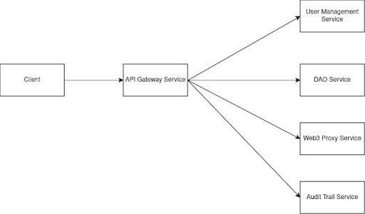
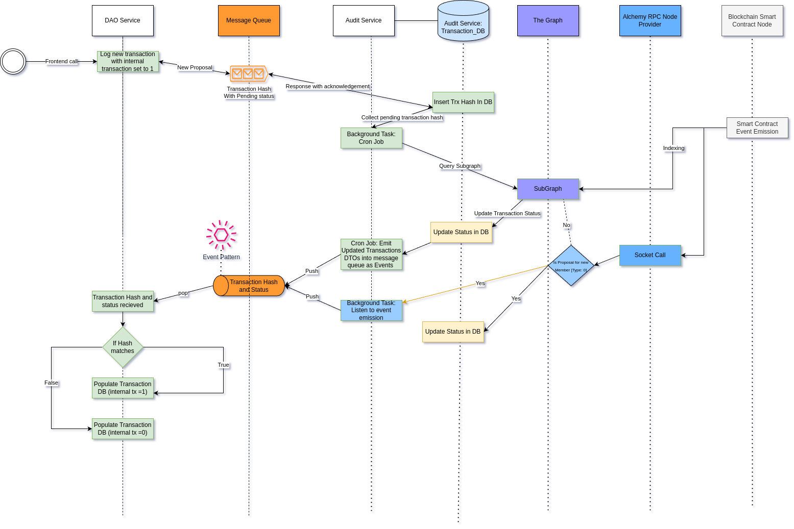

# FinCube Backend

[](https://ethereum.org/)
[](https://polygon.technology/)
[](https://www.blockchain.com/)
[](https://brainstation-23.com/)

## Overview

The backend for fincube is built to manage and support the decentralized autonomous organization (DAO) functionalities, financial services, and blockchain interactions required by the fincube platform. It is designed using modern technologies to ensure scalability, security, and interoperability with blockchain networks.

## Table of Contents

- [FinCube Backend](#fincube-backend)
  - [Overview](#overview)
  - [Table of Contents](#table-of-contents)
  - [Technologies](#technologies)
  - [Architecture](#architecture)
  - [Services](#services)
    - [DAO Service](#dao-service)
    - [User Management Service](#user-management-service)
    - [Web3 Proxy Service](#web3-proxy-service)
    - [Audit Trail Service](#audit-trail-service)
    - [API Gateway](#api-gateway)
  - [Message Queue Payload](#message-queue-payload)
  - [Installation](#installation)
  - [Configuration](#configuration)
    - [Example `.env` file for DAO Service:](#example-env-file-for-dao-service)

## Technologies

- **Layer 1:** Ethereum
- **Layer 2:** Polygon
- **Technology:** Blockchain
- **Backend Framework:** NestJS
- **Database:** PostgreSQL
- **Messaging Queue:** RabbitMQ
- **Containerization:** Docker
- **API Gateway:** Nginx
- **Authentication:** Auth0
- **Web3 Integration:** Alchemy, Web3JS

## Architecture

The backend is structured into multiple microservices, each responsible for specific functionalities:

1. **DAO Service:** DAO-service maintains the database of DAO and each DAOs can have multiple proposals under them. At the moment, we test using a singular DAO, but multiple DAOs can be managed using the system. Users can interact with proposal services given they have authentication. Proposal database needs to sync in with the Audit-Trail database. 
2. **User Management Service:** User management service consists of user registration and login. Currently, auth0 is also integrated with registration and login. 
During registration, the subject (sub) of user is stored in auth table along with the role of the user. Their account information is stored in mfs and exchange_user table. 

During login, the authentication service retrieves the role of the user from the Authentication database. DAO-service, web3-proxy-service does inter service call to user-managment-service to get authenticated.

3. **Web3 Proxy Service:** 

The Web3 Proxy Service performs smart contract invocations and is configured with Alchemy API and web3JS. The private key of the admin is provided in the environment file. The functions implemented with the proxy service are:

- **Proposal Threshold**
- **Register Member (GAS | Super Admin)**
- **Execute Proposal (GAS & Super Admin)**
- **Get On Going Proposal Count**
- **Get On Going Proposals**

4. **Audit Trail Service:** This is currently a NestJS microservice. It has a message queue connection with DAO-service. It is another NestJS microservice. Audit trail service can post to the message queue and also receive messages from the message queue. 
5. **API Gateway:** There is a service registry configured in API gateway(Hardcoded). Client requests from frontend are rerouted using this API gateway. Axios and expressJS are used here. The code pipes HTTP requests along with their bodies and headers.



## Services

### DAO Service

- **Purpose:** Manage DAO creation, proposal submission, and voting.
- **API Endpoints:** `/dao-service`, `/dao-service/proposal-service`
- **Technology:** NestJS, PostgreSQL

### User Management Service

- **Purpose:** Handle user registration, authentication, and profile management.
- **API Endpoints:** `/user-management-service/mfs-business`, `/user-management-service/exchange-user`
- **Technology:** NestJS, PostgreSQL, Auth0

### Web3 Proxy Service

- **Purpose:** Interact with blockchain via smart contracts for DAO operations.
- **API Endpoints:** `/web3-proxy-service/web3-dao-proxy`
- **Technology:** NestJS, Alchemy, Web3JS

### Audit Trail Service

- **Purpose:** Record and track all DAO-related activities and proposals.
- **API Endpoints:** N/A (Message Queue integration)
- **Technology:** NestJS, RabbitMQ

### API Gateway

- **Purpose:** Client requests from frontend are rerouted using this API gateway.
- **API Endpoints:** N/A
- **Technology:** NestJS

## Message Broker Payloads
There are two message queues communicating between Audit-trail service and DAO service. 
 - From DAO Service to Audit Trail Service the queue is in `Message Pattern`. Here DAO Service is the publisher and Audit Trail Service is the consumer. As this is a `Message Pattern` Queue the DAO Service will also receive a response from Audit Trail Service.     

Endpoint: `[POST]<DOMAIN>/proposal-service` (Bearer Token Required)

The payload for the message queues is:

 ```json
{
  "id": 0,
  "proposer_address": "0x8152f498e91df80be19a28c83d8596f59fba80bd",
  "metadata": "This is a sample message pattern DTO. So you will be expecting a response with a Primary Key of Audit Trail DB Table.",
  "proposal_status": false,
  "external_proposal": false,
  "trx_hash": "0x696969ce6514379f0dac14dc365955e3a56367f230173fee93e47370d178a43e7"
}
```

- The another queue is in `Event Pattern` where Audit-Trail service is acting as Publisher and DAO service is the consumer. 

Endpoint: `[POST]<DOMAIN>/proposal-update/create-proposal`

The payload for the message queues is:
```json
{
  "proposer_address": "0xCBDC",
  "description": "This is an event ",
  "voteStart": "date-and-time",
  "voteEnd": "date-and-time",
  "transaction_data": {
	  "transactionHash": "0x9bedc4ae2294b431826aae10e11fd1795e690b7a6b92cc007ae7ca8f6b185c6c",
    "web3Status": 200 
  },
  "external_proposal": false
}
```



## Installation

To install and run the backend services, follow these steps:

1. **Clone the repository:**
    ```bash
    git clone https://github.com/FinCube-23/DAO-Proposal-Governance.git
    cd DAO-Proposal-Governance/backend
    ```

2. **Install dependencies:**
    Ensure you have Docker installed. Build the containers using:
    ```bash
    docker compose build
    ```

3. **Setup Docker:**
    Ensure you have Docker installed. Start the containers using:
    ```bash
    docker-compose up 
    ```

## Configuration

Each service has its own configuration file located in its respective directory. Make sure to set the necessary environment variables for database connections, Auth0, and blockchain API keys.

### Example `.env` file for DAO Service:
```plaintext
APP_ENV=
APP_PORT=
DB_HOST=
DB_PORT=
POSTGRES_DB=
POSTGRES_USER=
POSTGRES_PASSWORD=
PGADMIN_DEFAULT_EMAIL=
PGADMIN_DEFAULT_PASSWORD=
AUTH0_ISSUER_URL= 
AUTH0_AUDIENCE= 
SEPOLIA_API_KEY=
PROPOSAL_TOPIC=
PROPOSAL_END_TOPIC=
DAO_CONTRACT_ADDRESS= 

 ```
