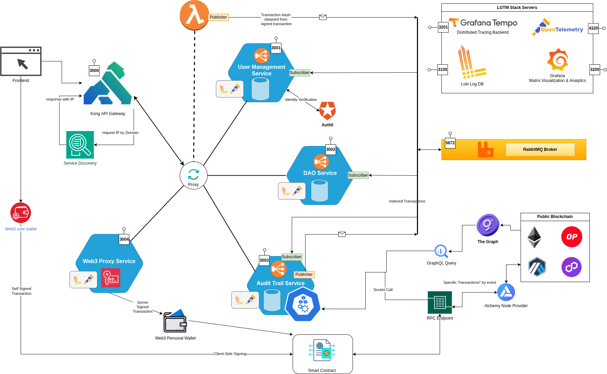
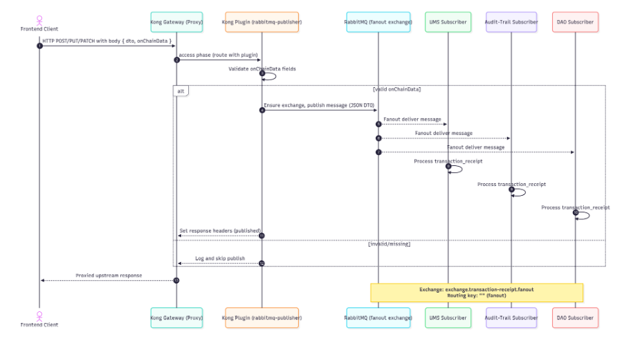
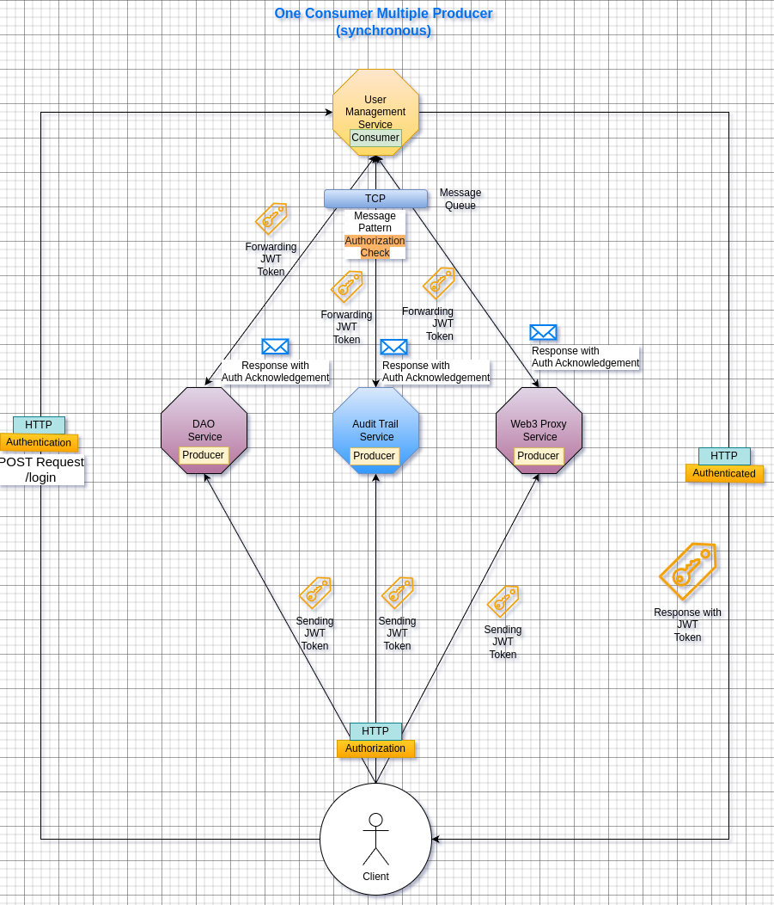
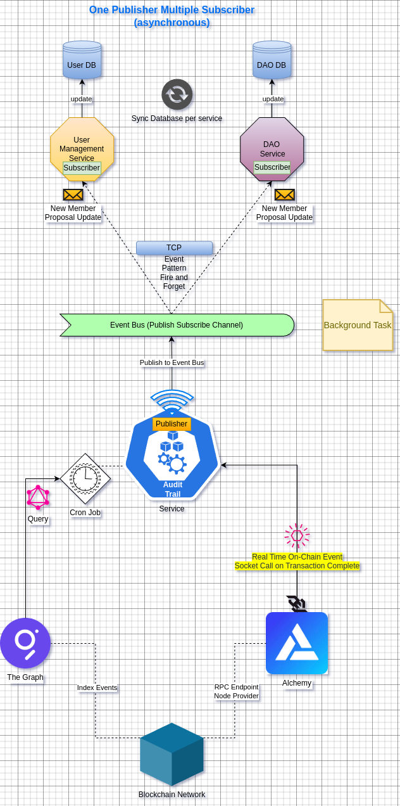
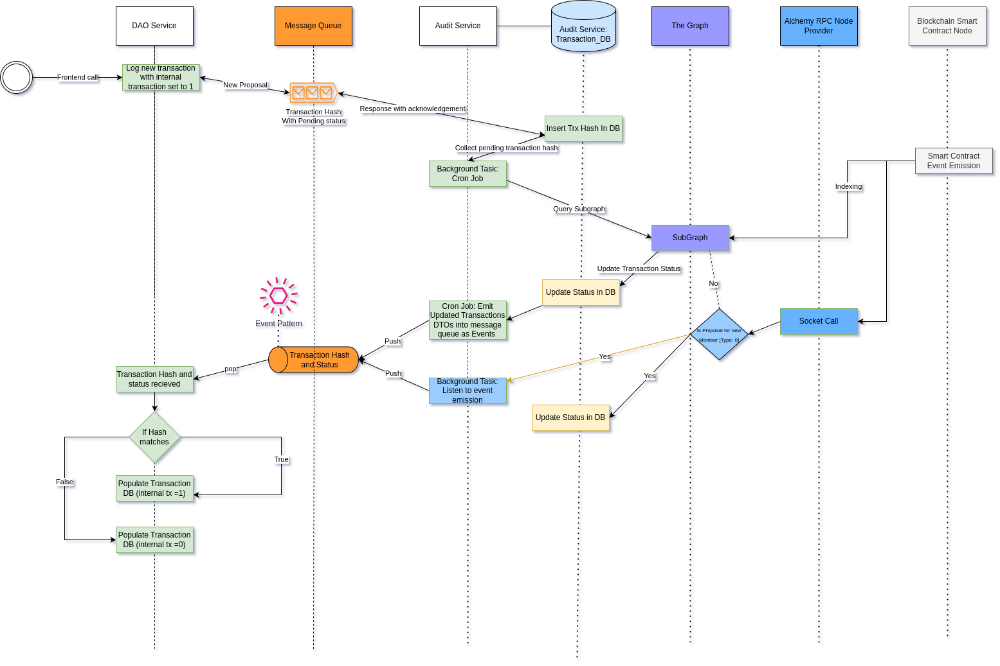

# FinCube Backend

[](https://ethereum.org/)
[](https://www.blockchain.com/)
[](https://brainstation-23.com/)

## Overview

The backend for fincube is built to manage and support the decentralized autonomous organization (DAO) functionalities, financial services, and blockchain interactions required by the fincube platform. It is designed using modern technologies to ensure scalability, security, and interoperability with blockchain networks.

## Table of Contents

- [FinCube Backend](#fincube-backend)
  - [Overview](#overview)
  - [Table of Contents](#table-of-contents)
  - [Technologies](#technologies)
  - [Architecture](#architecture)
    - [Backend Services](#backend-services)
    - [Frontend Services](#frontend-services)
    - [Web3 services](#web3-services)
  - [Services](#services)
    - [User Management Service](#user-management-service)
    - [DAO Service](#dao-service)
    - [Web3 Proxy Service](#web3-proxy-service)
    - [Audit Trail Service](#audit-trail-service)
    - [API Gateway](#api-gateway)
  - [Event Driven Architecture (EDA)](#event-driven-architecture-eda)
    - [Authorization Check in Micro-Service (Synchronous)](#authorization-check-in-micro-service-synchronous)
    - [Sync Web2 and Web3 Concurrently](#sync-web2-and-web3-concurrently)
    - [Sequence Diagram of DB sync process of transaction history](#sequence-diagram-of-db-sync-process-of-transaction-history)
  - [Installation](#installation)
  - [Configuration](#configuration)

## Technologies

- **Layer 1:** Ethereum
- **Technology:** Blockchain
- **Backend Framework:** NestJS, Django
- **Database:** PostgreSQL
- **Messaging Queue:** RabbitMQ
- **Containerization:** Docker
- **API Gateway:** Kong Gateway
- **Web3 Integration:** Alchemy, TheGraph
- **Event Bus:** RabbitMQ with Kong Custom Plugin

## Architecture

The backend is structured into multiple microservices, each responsible for specific functionalities:

For a comprehensive overview of how these services interact within the overall system architecture, refer to the following diagram.

 


1. **DAO Service:** DAO-service maintains the database of DAO and each DAOs can have multiple proposals under them. At the moment, we test using a singular DAO, but multiple DAOs can be managed using the system. Users can interact with proposal services given they have authentication. Proposal database needs to sync in with the Audit-Trail database. 

2. **User Management Service:** Built with Django framework, this service handles user registration, authentication, and profile management. It leverages Django's built-in admin interface for administrative tasks, user management, and database inspection. During login, the service retrieves user roles and permissions, which are used by other services (DAO-service, web3-proxy-service) for inter-service authentication via RabbitMQ message queue. This service is directly integrated with Kong API Gateway to capture on-chain events from frontend requests.

3. **Audit Trail Service:** This NestJS microservice is built as a plug-and-play module designed to fit into any dApp architecture, making it compatible with a variety of applications and blockchains. Currently, it records and tracks DAO-related activities, proposals, and FinCube transfer transactions, but its modular design allows it to scale to any blockchain use case. The service is directly integrated with Kong API Gateway to capture on-chain transaction data from frontend requests through the custom `rabbitmq-publisher` plugin. It implements a fault-tolerant event detection system using both Alchemy and TheGraph to ensure reliable on-chain event monitoring and synchronization. The service listens to the RabbitMQ fanout exchange to receive on-chain events and synchronize blockchain transaction data with the off-chain database.

### Backend Services

| Services                | Technology Used           |
| ----------------------- | ------------------------- |
| Audit-trail-service     | NestJS, Alchemy, TheGraph, RabbitMQ          |
| DAO-service             | NestJS, PostgreSQL        |
| API-gateway             | Kong Gateway, PostgreSQL  |
| User-management-service | Django, Django Admin, PostgreSQL |
| Web3-proxy-service      | NestJS, Alchemy, TheGraph   |

Backend folder contains more details regarding each of the services and the APIs.

### Frontend Services

<! -- we can add the screenshots from our project to this -->

### Web3 services

Web3 services contain the smart contracts, smart contract testcases, deployment, UUPS proxy deployment functionalities.

## Services

### User Management Service

- **Purpose:** Handle user registration, authentication, and profile management with Django admin interface for administrative tasks.
- **API Route:** `/user-management-service`
- **Technology:** Django, Django Admin, PostgreSQL, RabbitMQ (Consumer)
- **Kong Integration:** Directly captures on-chain events from frontend via Kong's `rabbitmq-publisher` plugin
- **Key Features:**
  - Django admin interface for user management
  - Role-based access control
  - Inter-service authentication provider
  - On-chain event processing for user-related blockchain transactions
  - Permission scheme for admins
  - Django admin dashboard
  - Inter-service authentication provider

### DAO Service

- **Purpose:** Manage DAO creation, proposal submission, and voting.
- **API Route:** `/dao-service`
- **Technology:** NestJS, PostgreSQL, RabbitMQ (Producer)

### Web3 Proxy Service

- **Purpose:** Interact with blockchain via smart contracts for DAO operations signed by organization's custodial wallet.
- **API Endpoints:** `/web3-proxy-service`
- **Technology:** NestJS, Alchemy, Web3JS, RabbitMQ (Producer)

### Audit Trail Service

- **Purpose:** Plug-and-play module for recording and tracking blockchain activities with fault-tolerant on-chain event detection. Currently supports DAO operations and FinCube transfers, scalable to any blockchain use case.
- **Architecture:** Modular design compatible with various dApps and blockchains
- **API Route:** `/audit-trail-service`
- **Technology:** NestJS, Alchemy, TheGraph, RabbitMQ (Publisher & Consumer)
- **Kong Integration:** Directly captures on-chain transaction data from frontend via Kong's `rabbitmq-publisher` plugin
- **Fault-Tolerant Event Detection:** Uses both Alchemy and TheGraph for reliable on-chain event monitoring
- **Key Features:**
  - **Plug-and-play architecture:** Easily integrates into any dApp ecosystem
  - **Blockchain agnostic design:** Scalable to work with multiple blockchain networks
  - **Current implementations:** DAO governance tracking, FinCube transfer monitoring
  - Dual-source on-chain event listener (Alchemy + TheGraph) for redundancy
  - Real-time transaction history tracking
  - Blockchain data validation and verification
  - Event publishing to other microservices
  - Automatic failover between Alchemy and TheGraph
  - Background task processing for pending transactions

### API Gateway

- **Purpose:** Central integration hub that routes client requests and publishes on-chain events to RabbitMQ for microservice synchronization.
- **Technology:** Kong Gateway with custom `rabbitmq-publisher` plugin, PostgreSQL
- **Ports:** 3000 (Proxy), 8001 (Admin API), 8002 (Admin GUI)
- **Direct Integrations:** 
  - Audit Trail Service: Captures on-chain transaction events
  - User Management Service: Captures user-related blockchain activities
- **Key Features:**
  - Automatic extraction of `onChainData` from client requests
  - Event publishing to RabbitMQ fanout exchange (`exchange.transaction-receipt.fanout`)
  - CORS support for frontend integration
  - Service routing to all backend microservices
  - Real-time on-chain event capture and distribution

The sequence diagram of on-chain data originating from frontend is as follows:

 

## Event Driven Architecture (EDA)
As our proposed solution involves multiple data sources and the fusion of different types of on-chain and off-chain networks, **EDA** is a suitable candidate for this project.

In the Web2 layer, where almost all user actions can be processed in real-time, `synchronous` messaging is sufficient to keep the databases of different services in sync. However, the modules that coordinate between Web2 and Web3 must rely on `asynchronous` events as on-chain transaction may require some time to process. Since EVM-based smart contracts have built-in on-chain event functionality, we can leverage this to design our dApp using Event-Driven Architecture.

### Authorization Check in Micro-Service (Synchronous) 

These distributed service endpoints are secured by an auth guard. This auth guard is a decorator that functions as a `Producer`. When a REST API of a service is called, that service collects the `JWT Token` from the request cookie and sends it through a message queue to the User Management Service, which then responds with an acknowledgment.



### Sync Web2 and Web3 Concurrently

As our system is a hybrid ecosystem of blockchain and conventional enterprise microservices, the data storage system is also hybrid. To keep all the different data synced between the Web2 and Web3 layers, this Event Driven architecture is proposed. For example, when a new DAO member proposal is created at the smart contract level, the Web3 event syncs the on-chain `proposal id` to the Audit Trail service, which listens for on-chain events as background tasks. This single Web2 service publishes a Web2 event to the event bus, where other required subscriber services, like the DAO service and User Management Service, sync their off-chain proposal database and KYC profile database with that `proposal id`, ensuring that this information can be tracked and audited according to enterprise best practices.

**Kong API Gateway Integration:** Kong plays a crucial role in this architecture by capturing on-chain events directly from frontend requests through its custom `rabbitmq-publisher` plugin. When frontend submits requests with `onChainData` field, Kong automatically extracts and publishes these events to the RabbitMQ fanout exchange (`exchange.transaction-receipt.fanout`). Both Audit Trail Service and User Management Service are directly integrated with Kong as subscribers to this exchange, receiving real-time on-chain event notifications without requiring complex frontend orchestration.




### Sequence Diagram of DB sync process of transaction history 
There are two pattern used between **Audit-trail** service and **DAO service** for inter-service communication. 
From DAO Service to Audit Trail Service the queue is in `Message Pattern` where a transaction hash is collected from the frontend when a proposal was placed. As this is a `Message Pattern` Queue the DAO Service will also receive a response from Audit Trail Service which is a `Primary key` of that transaction at the Audit-trail DB. 

On the other side the Audit-trail service is running background tasks to track the pending on-chain transaction's update by their transaction hashes provided by the DAO service. If the transaction is successful the on-chain events will notify the Audit-trail and Audit-trail will notify the DAO service through rabbitMQ `Event Pattern`.



<!-- ## Message Broker Payloads
There are two message queues communicating between Audit-trail service and DAO service. 
 - From DAO Service to Audit Trail Service the queue is in `Message Pattern`. Here DAO Service is the publisher and Audit Trail Service is the consumer. As this is a `Message Pattern` Queue the DAO Service will also receive a response from Audit Trail Service.     

Endpoint: `[POST]<DOMAIN>/proposal-service` (Bearer Token Required)

The payload for the message queues is:

 ```json
{
  "proposal_type": "membership",
  "metadata": "New MFS onboarding request.....",
  "proposer_address": "0xBb85D1852E67D6BEaa64A7eDba802189F0714F97",
  "trx_hash": "0xTesting"
}
```

- The another queue is in `Event Pattern` where Audit-Trail service is acting as Publisher and DAO service is the consumer. 

Endpoint: `[POST]<DOMAIN>/proposal-update/create-proposal`

The payload for the message queues is:
```json
{
    "web3Status": 200,
    "message": "This is a drill",
    "blockNumber": 123321,
    "transactionHash": "0xTesting"
}
```

## API Gateway & Event-Driven Architecture

### Kong Gateway with Custom RabbitMQ Plugin

The API Gateway implements an event-driven architecture that automatically synchronizes on-chain activities across all microservices without requiring complex frontend orchestration.

#### How It Works

1. **Client Request with On-Chain Data**
   - Frontend submits requests with a standardized `onChainData` field containing blockchain transaction details
   - Preserves existing API contracts - no changes to conventional DTOs

2. **Kong Plugin Processing**
   - Custom `rabbitmq-publisher` plugin intercepts POST/PUT/PATCH requests
   - Extracts `onChainData` field from request body
   - Publishes event to RabbitMQ fanout exchange (`exchange.transaction-receipt.fanout`)

3. **Direct Service Integration**
   - Kong directly integrates with Audit Trail Service and User Management Service
   - Both services subscribe to the fanout exchange to receive on-chain events
   - Services process events asynchronously and update their respective databases
   - Ensures consistency across all microservices without frontend complexity

#### OnChainData Format

```typescript
{
  // Existing DTO fields remain unchanged
  email: "user@example.com",
  password: "hashedPassword",
  
  // Standardized on-chain data field
  onChainData: {
    transactionHash: "0x1234567890abcdef...",
    signedBy: "0xWalletAddress...",
    signedWith: "MetaMask",
    chainId: "1",
    context: "user-registration"
  }
}
```

#### Kong Configuration

- **Proxy Port:** 3000 (Client requests)
- **Admin API:** 8001 (Configuration management)
- **Admin GUI:** 8002 (Web-based administration)
- **Database:** PostgreSQL (Configuration persistence)
- **Custom Plugins:** `rabbitmq-publisher`, `cors`, `redirect`

#### RabbitMQ Integration

- **Exchange:** `exchange.transaction-receipt.fanout` (Fanout type)
- **Credentials:** `guest:guest` (Development)
- **Management UI:** http://localhost:15672
- **CORS Enabled:** Allows frontend direct access to queue monitoring

For detailed Kong configuration, see [`backend/api-gateway/README.md`](backend/api-gateway/README.md)

 -->

## Installation

To install and run the backend services, follow these steps:

1. **Clone the repository:**
    ```bash
    git clone https://github.com/FinCube-23/DAO-Proposal-Governance.git
    cd DAO-Proposal-Governance
    ```

2. **Orchestrate the entire backend:**
    
    The project includes a convenient shell script to manage all backend microservices with a single command. Use the following to start all backend services:
    
    ```bash
    ./run.sh up-be
    ```
    
    This command will:
    - Ensure the required Docker network (`fincube23_network`) exists
    - Start all backend microservices in the correct order:
      - RabbitMQ (Message Queue)
      - Log Server (Grafana, Loki, Tempo)
      - Audit Trail Service
      - User Management Service
      - DAO Service
      - Web3 Proxy Service
      - API Gateway (Kong)
    
    **Other useful commands:**
    
    ```bash
    # Start a specific service
    ./run.sh up-one <service-name>
    
    # Stop all backend services
    ./run.sh down
    
    # Stop a specific service
    ./run.sh down-one <service-name>
    
    # Start frontend only
    ./run.sh up-fe
    
    # Start both frontend and backend
    ./run.sh up
    
    # Show all available commands
    ./run.sh help
    ```
    
    **Available services:**
    - `rabbitmq`
    - `log-server`
    - `audit-trail-service`
    - `user-management-service`
    - `dao-service`
    - `web3-proxy-service`
    - `api-gateway`

3. **Verify services are running:**
    ```bash
    docker ps
    ```
    
    You should see all backend containers running with their respective ports exposed.

## Configuration

Each service has its own configuration file located in its respective directory. Make sure to set the necessary environment variables for database connections, and blockchain API keys.

