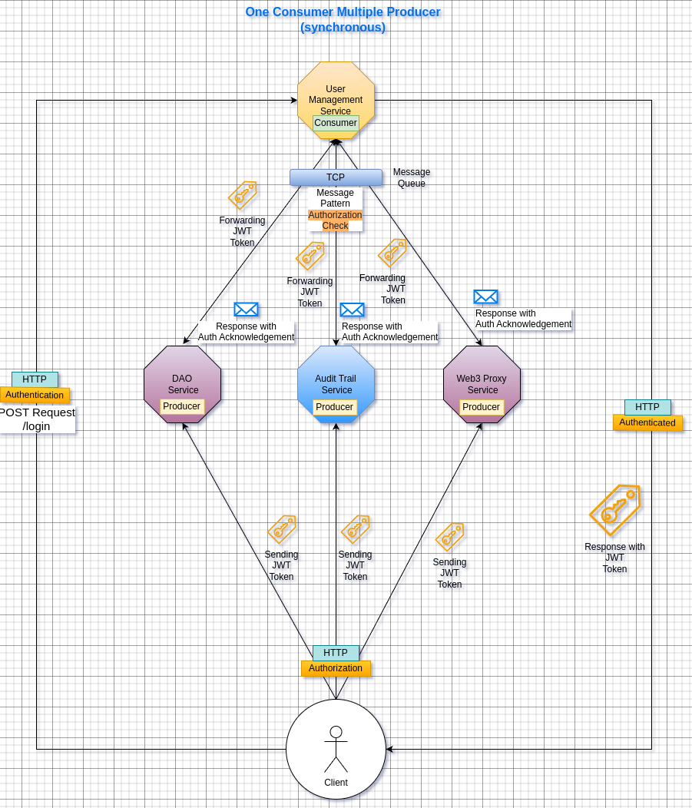

# FinCube Backend

[](https://ethereum.org/)
[](https://polygon.technology/)
[](https://www.blockchain.com/)
[](https://brainstation-23.com/)

## Overview

The backend for fincube is built to manage and support the decentralized autonomous organization (DAO) functionalities, financial services, and blockchain interactions required by the fincube platform. It is designed using modern technologies to ensure scalability, security, and interoperability with blockchain networks.

## Table of Contents

- [FinCube Backend](#fincube-backend)
  - [Overview](#overview)
  - [Table of Contents](#table-of-contents)
  - [Technologies](#technologies)
  - [Architecture](#architecture)
  - [Services](#services)
    - [DAO Service](#dao-service)
    - [User Management Service](#user-management-service)
    - [Web3 Proxy Service](#web3-proxy-service)
    - [Audit Trail Service](#audit-trail-service)
    - [API Gateway](#api-gateway)
  - [Message Queue Payload](#message-queue-payload)
  - [Installation](#installation)
  - [Configuration](#configuration)
    - [Example `.env` file for DAO Service:](#example-env-file-for-dao-service)

## Technologies

- **Layer 1:** Ethereum
- **Layer 2:** Polygon
- **Technology:** Blockchain
- **Backend Framework:** NestJS
- **Database:** PostgreSQL
- **Messaging Queue:** RabbitMQ
- **Containerization:** Docker
- **API Gateway:** Nginx
- **Authentication:** Auth0
- **Web3 Integration:** Alchemy, Web3JS

## Architecture

The backend is structured into multiple microservices, each responsible for specific functionalities:

1. **DAO Service:** DAO-service maintains the database of DAO and each DAOs can have multiple proposals under them. At the moment, we test using a singular DAO, but multiple DAOs can be managed using the system. Users can interact with proposal services given they have authentication. Proposal database needs to sync in with the Audit-Trail database. 
2. **User Management Service:** User management service consists of user registration and login. Currently, auth0 is also integrated with registration and login. 
During registration, the subject (sub) of user is stored in auth table along with the role of the user. Their account information is stored in mfs and exchange_user table. 

During login, the authentication service retrieves the role of the user from the Authentication database. DAO-service, web3-proxy-service does inter service call to user-managment-service to get authenticated.

3. **Web3 Proxy Service:** 

The Web3 Proxy Service performs smart contract invocations and is configured with Alchemy API and web3JS. The private key of the admin is provided in the environment file. The functions implemented with the proxy service are:

- **Proposal Threshold**
- **Register Member (GAS | Super Admin)**
- **Execute Proposal (GAS & Super Admin)**
- **Get On Going Proposal Count**
- **Get On Going Proposals**

4. **Audit Trail Service:** This is currently a NestJS microservice. It has a message queue connection with DAO-service. It is another NestJS microservice. Audit trail service can post to the message queue and also receive messages from the message queue. 
5. **API Gateway:** There is a service registry configured in API gateway(Hardcoded). Client requests from frontend are rerouted using this API gateway. Axios and expressJS are used here. The code pipes HTTP requests along with their bodies and headers.


## Services

### User Management Service

- **Purpose:** Handle user registration, authentication, and profile management.
- **API Route:** `/user-management-service`
- **Technology:** NestJS, PostgreSQL, RabbitMQ (Consumer)

### DAO Service

- **Purpose:** Manage DAO creation, proposal submission, and voting.
- **API Route:** `/dao-service`
- **Technology:** NestJS, PostgreSQL, RabbitMQ (Producer)

### Web3 Proxy Service

- **Purpose:** Interact with blockchain via smart contracts for DAO operations signed by organization's custodial wallet.
- **API Endpoints:** `/web3-proxy-service`
- **Technology:** NestJS, Alchemy, Web3JS, RabbitMQ (Producer)

### Audit Trail Service

- **Purpose:** Record and track all DAO-related activities and proposals.
- **API Route:** `/audit-trail-service`
- **Technology:** NestJS, RabbitMQ (Publisher)

### API Gateway

- **Purpose:** Client requests from frontend are rerouted using this API gateway.
- **API Endpoints:** N/A
- **Technology:** nginx

## Event Driven Architecture (EDA)
As our proposed solution involves multiple data sources and the fusion of different types of on-chain and off-chain networks, **EDA** is a suitable candidate for this project.

In the Web2 layer, where almost all user actions can be processed in real-time, `synchronous` messaging is sufficient to keep the databases of different services in sync. However, the modules that coordinate between Web2 and Web3 must rely on `asynchronous` events as on-chain transaction may require some time to process. Since EVM-based smart contracts have built-in on-chain event functionality, we can leverage this to design our dApp using Event-Driven Architecture.

### Authorization Check in Micro-Service (Synchronous) 

These distributed service endpoints are secured by an auth guard. This auth guard is a decorator that functions as a `Producer`. When a REST API of a service is called, that service collects the `JWT Token` from the request cookie and sends it through a message queue to the User Management Service, which then responds with an acknowledgment.



### Sync Web2 and Web3 Data Sources per Service (Asynchronous)  

As our system is a hybrid ecosystem of blockchain and conventional enterprise microservices, the data storage system is also hybrid. To keep all the different data synced between the Web2 and Web3 layers, this Event Driven architecture is proposed. For example, when a new DAO member proposal is created at the smart contract level, the Web3 event syncs the on-chain `proposal id` to the Audit Trail service, which listens for on-chain events as background tasks. This single Web2 service publishes a Web2 event to the event bus, where other required subscriber services, like the DAO service and User Management Service, sync their off-chain proposal database and KYC profile database with that `proposal id`, ensuring that this information can be tracked and audited according to enterprise best practices.


### Sequence Diagram of DB sync process of transaction history
There are two pattern used between **Audit-trail** service and **DAO service** for inter-service communication. 
From DAO Service to Audit Trail Service the queue is in `Message Pattern` where a transaction hash is collected from the frontend when a proposal was placed. As this is a `Message Pattern` Queue the DAO Service will also receive a response from Audit Trail Service which is a `Primary key` of that transaction at the Audit-trail DB. 

On the other side the Audit-trail service is running background tasks to track the pending on-chain transaction's update by their transaction hashes provided by the DAO service. If the transaction is successful the on-chain events will notify the Audit-trail and Audit-trail will notify the DAO service through rabbitMQ `Event Pattern`.


<!-- ## Message Broker Payloads
There are two message queues communicating between Audit-trail service and DAO service. 
 - From DAO Service to Audit Trail Service the queue is in `Message Pattern`. Here DAO Service is the publisher and Audit Trail Service is the consumer. As this is a `Message Pattern` Queue the DAO Service will also receive a response from Audit Trail Service.     

Endpoint: `[POST]<DOMAIN>/proposal-service` (Bearer Token Required)

The payload for the message queues is:

 ```json
{
  "proposal_type": "membership",
  "metadata": "New MFS onboarding request.....",
  "proposer_address": "0xBb85D1852E67D6BEaa64A7eDba802189F0714F97",
  "trx_hash": "0xTesting"
}
```

- The another queue is in `Event Pattern` where Audit-Trail service is acting as Publisher and DAO service is the consumer. 

Endpoint: `[POST]<DOMAIN>/proposal-update/create-proposal`

The payload for the message queues is:
```json
{
    "web3Status": 200,
    "message": "This is a drill",
    "blockNumber": 123321,
    "transactionHash": "0xTesting"
}
``` -->

## Installation

To install and run the backend services, follow these steps:

1. **Clone the repository:**
    ```bash
    git clone https://github.com/FinCube-23/DAO-Proposal-Governance.git
    cd DAO-Proposal-Governance/backend
    ```

2. **Install dependencies:**
    Ensure you have Docker installed. Build the containers using:
    ```bash
    ./run.sh up-be
    ```

## Configuration

Each service has its own configuration file located in its respective directory. Make sure to set the necessary environment variables for database connections, and blockchain API keys.

