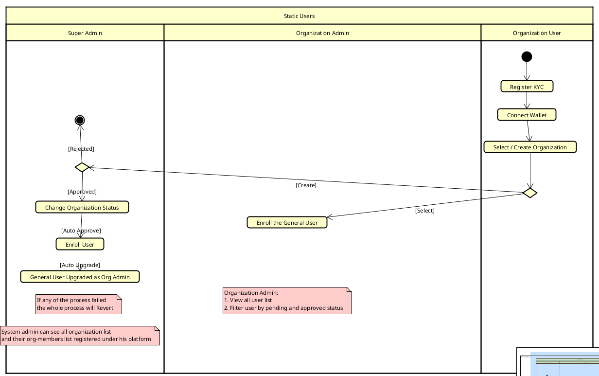

##  Development Setup — User Management Service

Before starting the service in development mode, be sure to initialize your database and create an administrative user:

```bash
# 1. Apply database migrations
python manage.py migrate

# 2. Create a superuser (admin account)
python manage.py createsuperuser
```

## User Management Activity Diagram



## User Management Service

