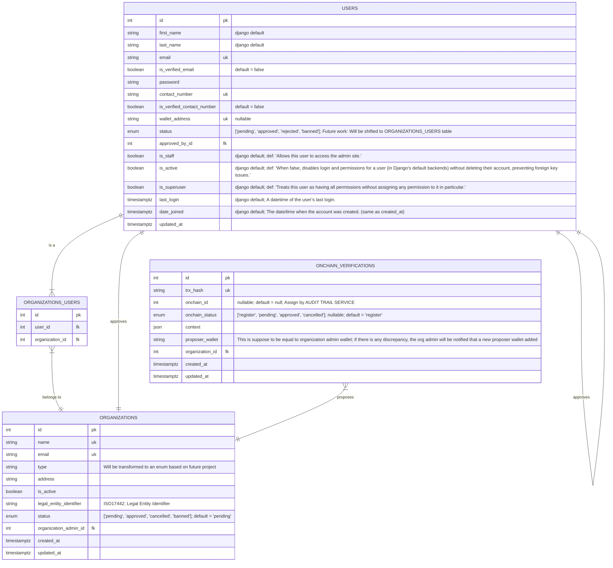
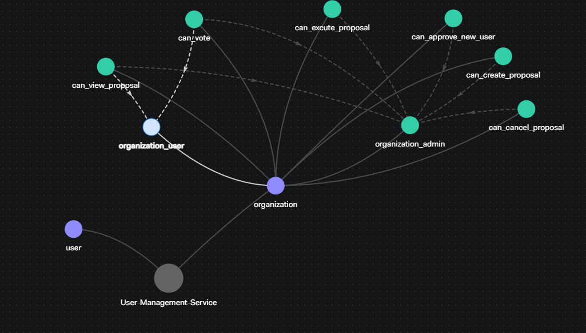
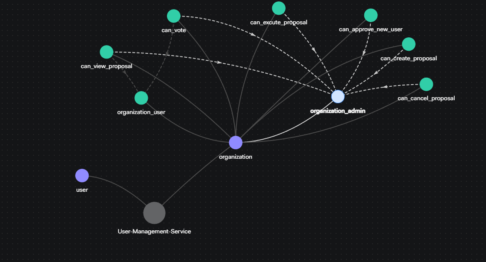

## Development Setup — User Management Service

Before starting the service in development mode, be sure to initialize your database and create an administrative user:

```bash
# 1. Apply database migrations
python manage.py migrate

# 2. Create a superuser (admin account)
python manage.py createsuperuser
```

## User Management Activity Diagram


## User Management Service ER Diagram



## API Endpoints

### User Management Service Endpoints

| Method | Endpoint | Authentication | Description |
|--------|----------|---------------|-------------|
| **User Authentication & Management** | | | |
| `POST` | `/api/users/login` | Public | User login with email and password |
| `POST` | `/api/users/register` | Public | User registration |
| `POST` | `/api/users/update-password` | Protected | Update user's password |
| `GET` | `/api/users/profile` | Protected | Get current user's profile details |
| `GET` | `/api/users/profile/{user_id}/` | Protected | Get specific user's profile by ID |
| `PATCH` | `/api/users/profile/update` | Protected | Update current user's profile (email, contact number, wallet) |
| `GET` | `/api/users/profile/status/{email}` | Protected | Get user status by email address |
| `GET` | `/api/users/user-list` | Protected | Get paginated list of all users with filtering |
| **Organization Management** | | | |
| `GET` | `/api/organizations/` | Protected | Get paginated list of all organizations with filtering |
| `POST` | `/api/organizations/` | Protected | Create new organization (auto-assigns current user as admin) |
| `GET` | `/api/organizations/{org_id}/` | Protected | Get detailed organization information by ID |
| `PATCH` | `/api/organizations/{org_id}/` | Protected | Update organization details (email, address only) |
| `POST` | `/api/organizations/users/` | Protected | Add user to organization |
| **On-Chain Verification Management** | | | |
| `POST` | `/api/organizations/onchain-verifications/` | Protected | Create new on-chain verification record |
| `GET` | `/api/organizations/{org_id}/onchain-verifications/` | Protected | Get paginated on-chain verifications for organization |
| **API Documentation** | | | |
| `GET` | `/api/docs/` | Public | Swagger UI documentation |
| `GET` | `/api/redoc/` | Public | ReDoc API documentation |
| `GET` | `/admin/` | Admin | Django admin interface |

### Service Discovery Access Format

To access endpoints through service discovery, use the format: `<service_name>/<endpoint_url>`

**Example Service Discovery Endpoints:**

| Method | Service Discovery URL | Direct URL | Description |
|--------|----------------------|------------|-------------|
| `POST` | `user-management-service/api/users/login` | `/api/users/login` | User login via service discovery |
| `GET` | `user-management-service/api/users/profile` | `/api/users/profile` | Get user profile via service discovery |
| `GET` | `user-management-service/api/organizations/` | `/api/organizations/` | Get organizations via service discovery |
| `POST` | `user-management-service/api/organizations/` | `/api/organizations/` | Create organization via service discovery |
| `GET` | `user-management-service/api/docs/` | `/api/docs/` | API documentation via service discovery |

**Service Information:**

- **Service Name**: `user-management-service`
- **Base URL Pattern**: `user-management-service/*`

## Role-Based Access Control (RBAC) Model

This project implements a **Role-Based Access Control (RBAC) model** using [OpenFGA](https://openfga.dev/) for modeling and visualizing roles and permissions at the **organization level**, enabling fine-grained access control planning for different types of users.

## Authorization Model

### 👥 Role Definitions

| Role | Description | Access Level |
|------|-------------|--------------|
| **🔐 organization_admin** | Full administrative rights within the organization | Complete control over users, proposals, and organizational actions |
| **👤 organization_user** | Standard member of the organization | Limited access to view and participate in governance |

### 🔑 Permission Matrix

| Permission | Admin | User | Description |
|------------|-------|------|-------------|
| `can_approve_new_user` | ✅ | ❌ | Approve new user registrations |
| `can_create_proposal` | ✅ | ❌ | Create new governance proposals |
| `can_view_proposal` | ✅ | ✅ | View existing proposals |
| `can_execute_proposal` | ✅ | ❌ | Execute approved proposals |
| `can_cancel_proposal` | ✅ | ❌ | Cancel pending proposals |
| `can_vote` | ✅ | ✅ | Vote on active proposals |

### 📊 Visual Model

The following diagrams illustrate the RBAC model in action:

| **Organization User Permissions** | **Organization Admin Permissions** |
|:---------------------------------:|:----------------------------------:|
|  |  |

> 💡 **Note**: These diagrams provide a comprehensive visual overview of role-based access patterns within an organization.

### 🎮 Interactive Visualization with OpenFGA Playground

Experiment with the RBAC model using the [**OpenFGA Playground**](https://play.fga.dev/) for hands-on testing:

#### 📋 Model Definition
```fga
model
  schema 1.1

type user
type organization
  relations
    define organization_admin: [user]
    define organization_user: [user]
    define can_approve_new_user: organization_admin
    define can_create_proposal: organization_admin
    define can_view_proposal: organization_admin or organization_user
    define can_execute_proposal: organization_admin
    define can_cancel_proposal: organization_admin
    define can_vote: organization_admin or organization_user
```

#### 🚀 Quick Start Guide

1. **📋 Copy** the FGA model code above
2. **🌐 Open** the [OpenFGA Playground](https://play.fga.dev/)
3. **📝 Paste** the model into the editor
4. **📊 Switch** to **Graph View** to visualize relationships
5. **🧪 Test** with example scenarios:

   | Query Example | Expected Result |
   |---------------|-----------------|
   | `Can user:alice view_proposal in org:1?` | ✅ (if alice is member) |
   | `Can user:bob execute_proposal in org:2?` | ✅ (only if bob is admin) |
   | `Can user:charlie can_vote in org:3?` | ✅ (if charlie is any member) |

---


## RabbitMQ
### Exchange Configuration

- **Exchange Name:** `exchange.ums.events`
- **Exchange Type:** `topic`

### Event Routing Keys

| Event | Routing Key |
|-------|-------------|
| Organization Created | `organization.created` |
| Organization User Added | `organization.user.created` |
| Sync All Data | `ums.sync` |