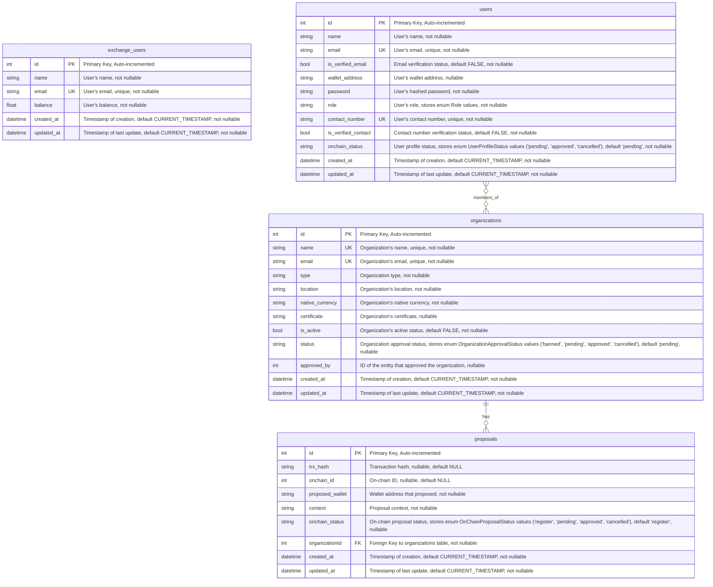

```mermaid
erDiagram
  
    exchange_users {
        int id PK "Primary Key, Auto-incremented"
        string name "User's name, not nullable"
        string email UK "User's email, unique, not nullable"
        float balance "User's balance, not nullable"
        datetime created_at "Timestamp of creation, default CURRENT_TIMESTAMP, not nullable"
        datetime updated_at "Timestamp of last update, default CURRENT_TIMESTAMP, not nullable"
    }

    users {
        int id PK "Primary Key, Auto-incremented"
        string name "User's name, not nullable"
        string email UK "User's email, unique, not nullable"
        bool is_verified_email "Email verification status, default FALSE, not nullable"
        string wallet_address "User's wallet address, nullable"
        string password "User's hashed password, not nullable"
        string role "User's role, stores enum Role values, not nullable"
        string contact_number UK "User's contact number, unique, not nullable"
        bool is_verified_contact "Contact number verification status, default FALSE, not nullable"
        string onchain_status "User profile status, stores enum UserProfileStatus values ('pending', 'approved', 'cancelled'), default 'pending', not nullable"
        datetime created_at "Timestamp of creation, default CURRENT_TIMESTAMP, not nullable"
        datetime updated_at "Timestamp of last update, default CURRENT_TIMESTAMP, not nullable"
    }

    organizations {
        int id PK "Primary Key, Auto-incremented"
        string name UK "Organization's name, unique, not nullable"
        string email UK "Organization's email, unique, not nullable"
        string type "Organization type, not nullable"
        string location "Organization's location, not nullable"
        string native_currency "Organization's native currency, not nullable"
        string certificate "Organization's certificate, nullable"
        bool is_active "Organization's active status, default FALSE, not nullable"
        string status "Organization approval status, stores enum OrganizationApprovalStatus values ('banned', 'pending', 'approved', 'cancelled'), default 'pending', nullable"
        int approved_by "ID of the entity that approved the organization, nullable"
        datetime created_at "Timestamp of creation, default CURRENT_TIMESTAMP, not nullable"
        datetime updated_at "Timestamp of last update, default CURRENT_TIMESTAMP, not nullable"
    }

    proposals {
        int id PK "Primary Key, Auto-incremented"
        string trx_hash "Transaction hash, nullable, default NULL"
        int onchain_id "On-chain ID, nullable, default NULL"
        string proposed_wallet "Wallet address that proposed, not nullable"
        string context "Proposal context, not nullable"
        string onchain_status "On-chain proposal status, stores enum OnChainProposalStatus values ('register', 'pending', 'approved', 'cancelled'), default 'register', nullable"
        int organizationId FK "Foreign Key to organizations table, not nullable"
        datetime created_at "Timestamp of creation, default CURRENT_TIMESTAMP, not nullable"
        datetime updated_at "Timestamp of last update, default CURRENT_TIMESTAMP, not nullable"
    }

    organizations ||--o{ proposals : has
    users }o--o{ organizations : members_of
```