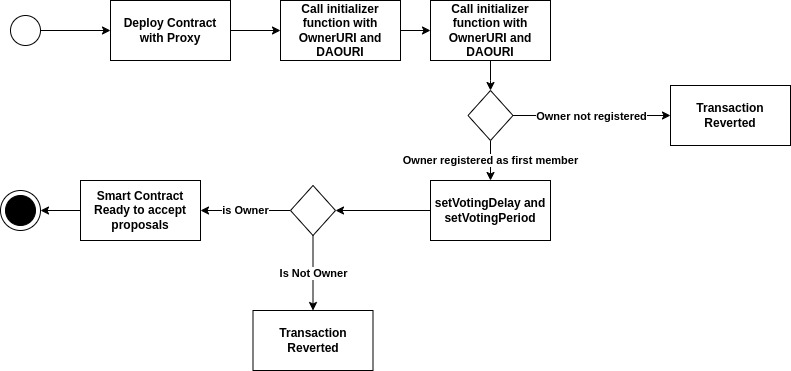
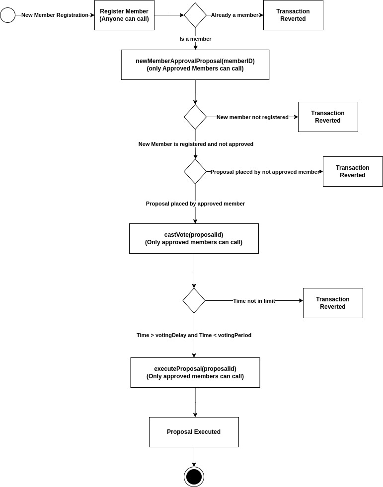

# Fincube Smart contract

This contract demonstrates a basic Hardhat use case. It comes with the smart contract for DAO proposal governance, testcases for that contract, smart contract deploy script with UUPS proxy and a Hardhat Ignition module that deploys that contract.

 ## Features

- **Proxy Pattern:** OpenZeppelin’s default proxy is the Transparent Proxy, but UUPS is recommended for being more lightweight and versatile. In a UUPS proxy, the upgrade logic is handled within the implementation contract itself rather than by the proxy.
- **Upgradeable Implementation:** Unlike Transparent Proxies, the UUPS proxy is not inherently upgradeable. The implementation contract must include the logic for updating its address stored in the proxy's storage. Fincube uses UUPSUpgradeable, inheriting from it and overriding the _authorizeUpgrade function for controlled access.
- **Security:** The built-in upgrade functionality prevents upgrading to a non-UUPS compliant implementation.
- **Access Control:** Fincube also inherits OwnableUpgradeable to manage ownership and access control during upgrades.

## Commands

For help run: 
```shell
npx hardhat help
```
To compile the contract run: 
```shell
npx hardhat compile
```
To run the testcases for the contract run: 
```shell
npx hardhat test
```
To calculate the gas fees for each test run:
```shell
REPORT_GAS=true npx hardhat test
```

# Smart Contract Deployment 
The smart contract is UUPSUpgradeable. To deploy follow:



During adding newMembers follow:


